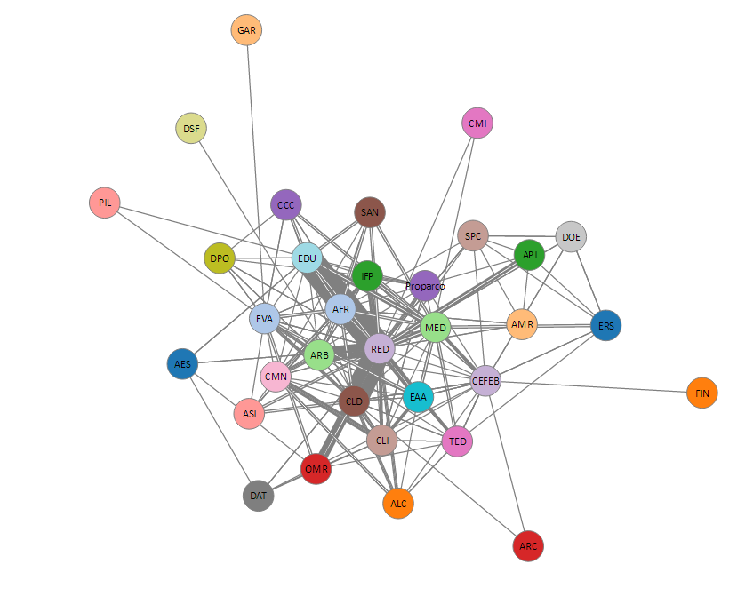

# Mapping AFD research collaboration using Networkchart-D3
This repository contains Python script (Network Graph AFD research.ipynb) to build a networkchart using D3js
It aims at mapping research collaboration among Agence Française de Dévelopment's divisions.
Research project can involve sevetal departments of AFD (up to 5). As we wanted to map bilateral collaboration, we decomposed team using permetation. for this we use Python itertools that allow display permutations.
e.g. a research project lead by a Team composed from 3 directions: CEFEB,DOE,ERS will end up being 3 bilateral collaborations 
(CEFEB,DOE),(CEFEB,ERS), (DOE, ERS)

The data is available in a text file in this repository

<a href="http://stats4dev.com/test/networkchart.html" target="_blank">Link to the resulting data viz</a>

Image of the dataviz:

